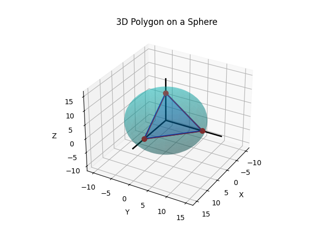

# Spherical Polygon Area Calculation

This Python program calculates the area of a polygon defined by vertices specified in spherical coordinates on a sphere. It also visualizes the polygon and the sphere in a 3D plot.

## Features

- Converts spherical coordinates (r, θ, φ) to Cartesian coordinates (x, y, z).
- Computes the angles between polygon edges using vector mathematics.
- Calculates the area of spherical polygons based on interior angles.
- Visualizes the sphere and the defined polygon in 3D.

## Requirements

- Python 3.x
- `numpy`
- `matplotlib`

You can install the required libraries using:

```bash
pip install numpy matplotlib
```

## Usage

1. **Define Polygon Vertices**: Specify the vertices of the polygon in spherical coordinates. Each vertex is defined by a tuple of the form `(r, θ, φ)`, where:
   - `r` is the radius of the sphere,
   - `θ` is the azimuthal angle (longitude),
   - `φ` is the polar angle (colatitude).

    ```python
    radius = 10
    polygon_vertices = [
        (radius, math.radians(0), math.radians(0)),       # Vertex 1
        (radius, math.radians(0), math.radians(90)),      # Vertex 2
        (radius, math.radians(90), math.radians(90))      # Vertex 3
    ]
    ```

2. **Calculate Area**: Ensure that there are at least three vertices, and then calculate the area of the polygon using the `area_of_the_polygon` function. This function requires the interior angles of the polygon and the radius.

    ```python
    if len(polygon_vertices) < 3:
        print("At least 3 points are needed to form a polygon!")
    else:
        area = area_of_the_polygon(spherical_polygon_angles(polygon_vertices), radius)
        print('Area of the Polygon:', area)
    ```

3. **Visualize**: Visualize the polygon and the sphere in 3D using the `visualize_sphere_and_polygon` function. This will create a 3D plot showing the polygon on the sphere.

    ```python
    visualize_sphere_and_polygon(polygon_vertices, radius)
    ```

## Code Structure

- **spherical_to_cartesian(r, theta, phi)**: Converts spherical coordinates to Cartesian coordinates.
- **dot_product(v1, v2)**: Computes the dot product of two vectors.
- **magnitude(v)**: Returns the magnitude of a vector.
- **angle_between(v1, v2)**: Calculates the angle between two vectors.
- **points_to_normal(p1, p2, p3)**: Computes the normal vector to the plane defined by three points.
- **spherical_polygon_angles(vertices)**: Calculates the interior angles of the polygon.
- **area_of_the_polygon(interior_angles, radius)**: Calculates the area of the polygon based on its angles.
- **visualize_sphere_and_polygon(vertices, radius)**: Visualizes the sphere and polygon in 3D.

## Example Output

When you run the program, you will see output similar to the following:

```plaintext
Area of the Polygon: 157.07963267948966
```

The visualization of the spherical polygon is displayed as a 3D plot. You can find the output image in the project directory after running the script.



## License

This project is licensed under the MIT License.

## Acknowledgments

- [Matplotlib](https://matplotlib.org/) - A plotting library for Python that makes it easy to create visualizations.
- [NumPy](https://numpy.org/) - A fundamental package for scientific computing with Python.

## Contact

For any inquiries or feedback, feel free to reach out:

- **Name**: Nurpeissov Alisher
- **Email**: nurpeissov.a0818@gmail.com

## Disclaimer

This project is for educational purposes only. It is recommended to verify the accuracy of the calculations and results for critical applications.

